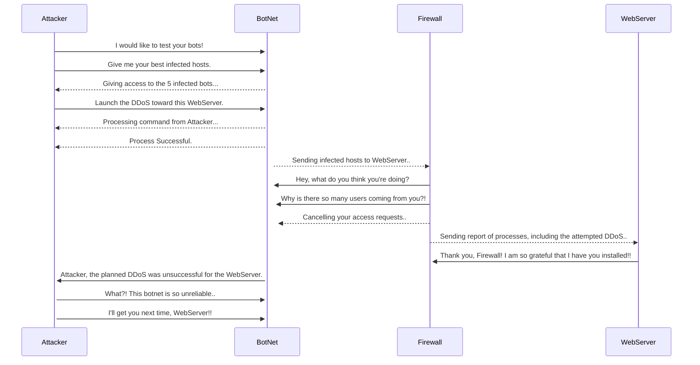

## Documentation
### Steps:
1. Attacker uses a command and control server to communicate with the chosen Botnet.
2. Attacker then sends the launch command from the command and control server to the botnet to start the DDoS attack.
3. The botnet will then send bots to send an attack traffic to the WebServer.
4. However, since there was a Firewall implemented, there will be a layer of security to notice the suspicious activity from IPs.
5. The firewall then blocks the suspicious IPs to prevent further harm from the attempted DDoS attack.