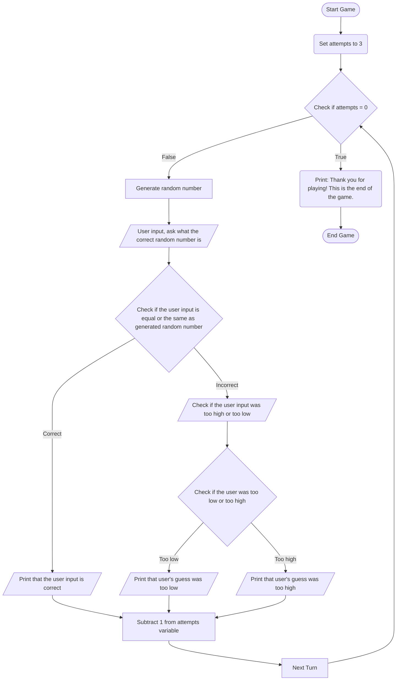

```mermaid
flowchart TD
Start([Start Game]) --> id1(Set attempts to 3)
id1(Set attempts to 3) --> id2{Check if attempts = 0}
id2 --> |False| id3[Generate random number] --> 
id4[/User input, ask what the correct random number is/] --> id11{Check if the user input is equal or the same as generated random number}
id11 --> |Incorrect| id5[/Check if the user input was too high or too low/]
id11 --> |Correct| id9[/Print that the user input is correct/]
id5 --> id12{Check if the user was too low or too high}
id9 --> id8
id12 --> |Too low| id6[/Print that user's guess was too low/]
id12 --> |Too high| id7[/Print that user's guess was too high/]
id6 --> id8[Subtract 1 from attempts variable]
id7 --> id8
id8 --> id10[Next Turn]
id10 --> id2

id2 --> |True| id13(Print: Thank you for playing! This is the end of the game.)
id13 --> End([End Game])

```