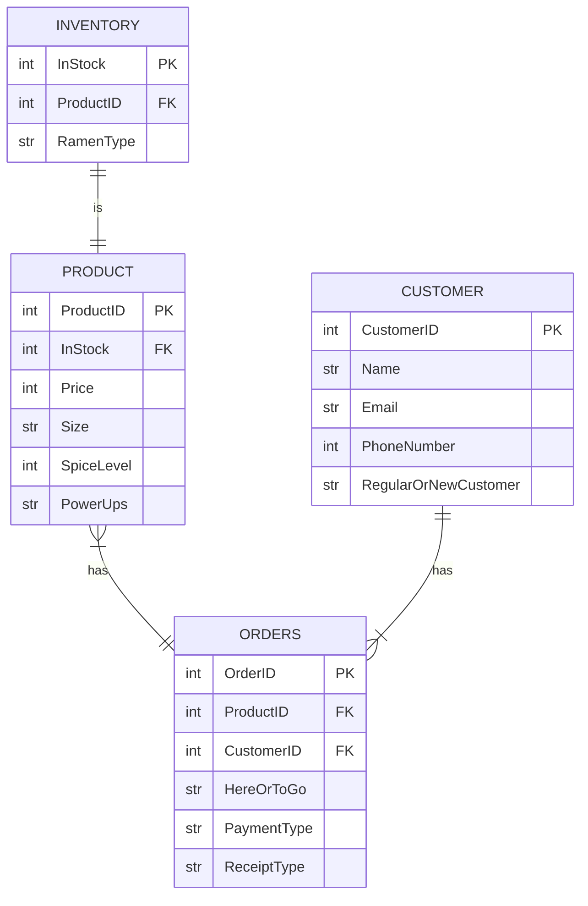

# Waterfall Soup - Ramen Shop

## Documentation

- PRODUCT:
1. ProductID, each product has its own unique id to easily identify the product.
2. To see the type of ramen in stock, InStock is a foreign key for PRODUCT
3. Price, the price of all of the specific modifications and the product itself.
4. Size, what size the product will be.
5. SpiceLevel, from 1-5, how spicy the product is.
6. PowerUps, what buffs the product gives to the consumer.

- CUSTOMER:
1. CustomerID, each customer has their own unique id to easily identify who the customer is.
2. Name, name of the customer.
3. Email, email of the customer.
4. PhoneNumber, phone number of the customer.
5. RegularOrNewCustomer, checks to see if the customer is a newcomer to the shop or has visited the shop multiple times.

- ORDERS:
1. OrderID, each order has its own unique id to easily identify which order is which.
2. To see what products the order contains, ProductID is a foreign key for ORDERS.
3. To see who the order is under, CustomerID is a foreign key for ORDERS.
4. HereOrToGo, if the order is for eating at the shop or packed for to go.
5. PaymentType, what kind of payment from customer: card or cash, etc.
6. ReceiptType, what type of receipt the customer wants: paper, email or text, etc.

- INVENTORY:
1. InStock, check if the ramen type is in stock.
2. To see if the inventory has the product with the specific details, ProductID is a forieign key for INVENTORY.
3. RamenType, what kind of ramen it is.

### Relationships:
- PRODUCT to ORDER, each order can have one or many products while each product can have one and only one order.
- CUSTOMER to ORDERS, each order can only have one customer while each customer can have one or many orders.
- INVENTORY to PRODUCT, there is only one of each item in stock with the product modifications.
